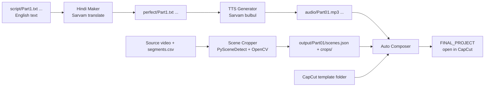

<div align="center">

# scene-to-capcut-draft-generator

**Video in, editable CapCut project out.** Finds the scenes, writes and voices the Hindi script, and builds a ready-to-edit CapCut draft with every image timed to the narration.


</div>

---

## In plain words

Making a "recap" video by hand means: cut the source video into scenes, grab one good frame per scene, write a script, translate it, record the voice, then drag every image onto a timeline and stretch it to fit the voice.

This app does that whole chain. At the end you get a **CapCut project folder**. Open it in CapCut and everything is already on the timeline, so you only fine-tune it.

It is free, open source, and runs on your machine. **You bring your own API keys. None are included.**

## Pipeline



## Features

- **Four tabs, one workflow.** Hindi Maker → Scene Cropper → TTS Generator → Auto Composer.
- **Colloquial Hindi translation.** Uses Sarvam's `mayura:v1` model in *modern-colloquial* mode. Long text is cut at sentence ends into chunks of up to 1,000 characters.
- **Key rotation.** Add several Sarvam keys. The app switches key on errors like `403` and `429`.
- **Smart scene detection.** Uses PySceneDetect's content detector, takes the middle frame of every scene, and crops away borders with OpenCV.
- **Parallel processing.** Up to 6 parts are processed at once. Parts that already have a `scenes.json` are skipped.
- **Timeline math done for you.** Each image gets a share of the narration equal to its scene's share of the video, so pacing follows the original.
- **Motion on every image.** Copies the keyframe animation from your CapCut template and reverses it on every second image for variety.
- **Optional local TTS.** `alltalk.py` connects to a local [AllTalk](https://github.com/erew123/alltalk_tts) (XTTS v2) server instead of Sarvam.

## Requirements

### Software

| Tool | Needed for | Required? |
|---|---|---|
| Python 3.10 or newer | Running the app | Yes |
| [FFmpeg](https://ffmpeg.org/download.html) and `ffprobe` on your `PATH` | Cutting and audio conversion | Yes |
| **NVIDIA GPU with NVENC** and an FFmpeg build that supports `h264_nvenc` | Scene Cropper video pre-encode | Yes (as currently written) |
| [CapCut](https://www.capcut.com/) desktop | Opening the generated project | Yes |
| [AllTalk](https://github.com/erew123/alltalk_tts) server on port 7851 | Only for `alltalk.py` | No |

### Accounts and keys (bring your own)

| Service | What you need | Where to enter it | Notes |
|---|---|---|---|
| [Sarvam AI](https://www.sarvam.ai/) | One or more API subscription keys | **Hindi Maker** tab and **TTS Generator** tab | Check Sarvam's current pricing and free credits. |

**How to enter keys**

- Hindi Maker: separate keys with **commas**.
- TTS Generator: put **one key per line** (spaces and new lines both work).

> **Never commit your keys.** Type them into the app only.

## Install

```bash
git clone https://github.com/saumitratambe/scene-to-capcut-draft-generator.git
cd scene-to-capcut-draft-generator
python -m venv .venv
# Windows:  .venv\Scripts\activate
# macOS/Linux:  source .venv/bin/activate
pip install -r requirements.txt
```

Check that the tools are reachable:

```bash
ffmpeg -version
scenedetect version
```

## Prepare your project folder

Make one **root folder** for the video. Put these three things in it:

```text
my-recap/                     <- select this in the app
├── recap.mp4                 <- your source video (.mp4, .mkv or .mov). Only one.
├── segments.csv              <- one line per part: start,end  (HH:MM:SS)
└── script/
    ├── Part1.txt             <- English script for part 1
    ├── Part2.txt
    └── ...
```

Example `segments.csv`:

```csv
00:00:00,00:04:12
00:04:12,00:09:40
```

The app then creates:

```text
my-recap/
├── perfect/     translated scripts (Hindi)      <- Hindi Maker
├── audio/       Part01.mp3, Part02.mp3 ...      <- TTS Generator
├── output/
│   └── Part01/  scenes.json + crops/crop1.png … <- Scene Cropper
└── work/        temporary files
```

> Tip: the timestamp-to-CSV helper in the sibling project `audio-video-sync-pipeline` can build `segments.csv` and `script/PartN.txt` from a timestamped transcript.

### Make a CapCut template (one time)

The builder needs a **template draft** so it can copy your look and animation.

1. In CapCut, create a new project.
2. Add **one image** to the main video track. Add the zoom or pan **keyframes** and any effects you like for it.
3. Save the project and find its folder. On Windows drafts are usually under `%LOCALAPPDATA%\CapCut\User Data\Projects\com.lveditor.draft\`. The path may differ by version.
4. Copy that folder somewhere safe. This is your **template folder**. It must contain `draft_info.json`.

The tool clones the first segment of the first video track for every scene.

> CapCut's draft format is not public and can change between versions. If a newer CapCut version cannot open the generated project, re-create the template with the same version you use.

## How to use

Run `python main.py`.

1. **Hindi Maker.** Paste keys, select the root folder, click **Start**. Files from `script/` are translated into `perfect/`. Existing files are skipped.
2. **Scene Cropper.** Select the root folder and start. It finds scenes and writes `output/PartNN/scenes.json` and `crops/`.
3. **TTS Generator.** Paste keys, choose language (`hi-IN` or `en-IN`) and a voice (`shubh`, `priya`, `neha`, `amit`, `rahul`, `rohan`), select the root folder, click **Start**. It reads `perfect/` and writes `audio/`. It also keeps watching the folder every minute for new scripts.
4. **Auto Composer.** Select the **root folder**, the **template folder**, and an **output folder**, then click **Build**.
5. Open `<output>/FINAL_PROJECT` in CapCut. The media path is stored inside the draft, so build directly into the place CapCut reads drafts from, or keep the folder where it was built.

> **Warning:** each build **deletes** an existing `FINAL_PROJECT` folder inside your chosen output folder. Pick an empty folder.

### Using AllTalk instead of Sarvam for voice

1. Start your AllTalk server (default `http://127.0.0.1:7851`).
2. Run `python alltalk.py`, select the same root folder, and start.
3. It reads `perfect/`, writes WAV files to `audio/`, and the Auto Composer converts them to MP3 for you.

## Configuration reference

| File | Setting | Default | Meaning |
|---|---|---|---|
| `scene_extractor.py` | `MAX_WORKERS` | 6 | Parts processed in parallel. Lower it on weaker machines. |
| `scene_extractor.py` | `EDGE_THRESHOLD_RATIO` | 0.06 | How strict the border detection is |
| `scene_extractor.py` | `SAFE_PADDING` | 2 | Extra pixels kept around a crop |
| `sarvam_translator.py` | `MODEL`, `MAX_CHARS` | `mayura:v1`, 1000 | Translation model and chunk size |
| `sarvam_tts.py` | `WATCH_INTERVAL_MS` | 60000 | How often the TTS tab rescans for new scripts |
| `alltalk.py` | `ALLTALK_URL` | `http://127.0.0.1:7851/api/tts-generate` | Where your AllTalk server runs |

Model names can change. Check Sarvam's docs if you see model errors.

## Troubleshooting

| Problem | Fix |
|---|---|
| `scenedetect` not found | `pip install "scenedetect[opencv]"` inside your virtual environment, then restart the terminal. |
| FFmpeg error mentioning `h264_nvenc` | You need an NVIDIA GPU and an NVENC-enabled FFmpeg. Otherwise change the encoder in `scene_extractor.py` to `libx264`. |
| "script folder missing" | Create `script/` in the root folder and add `Part1.txt`, `Part2.txt`, … |
| A part is skipped in the composer | It needs both `audio/PartNN.mp3` and `output/PartNN/scenes.json`. |
| CapCut cannot open the project | Rebuild the template with your current CapCut version. Make sure it has a video track with at least one segment. |
| Sarvam returns 403 or 429 | Key is invalid or rate-limited. Add more keys. Finished files are skipped on restart. |

## Known limitations

- Scene pre-encoding is written for NVIDIA GPUs.
- Depends on CapCut's undocumented draft format, so it can break after CapCut updates.

## Responsible use

Use this only with video, text, and images that you **own or have permission to use**. Respect the terms of the API providers you connect.

## Contributing

Issues and pull requests are welcome. Ideas: automatic NVENC/CPU fallback, a CLI mode, and tests for the timeline math.

## License

MIT. See `LICENSE`. Copyright © Saumitra Tambe.
